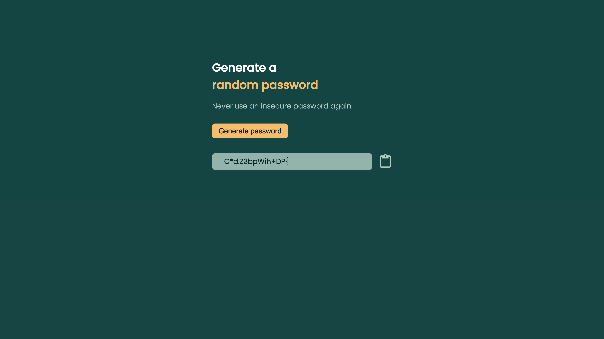
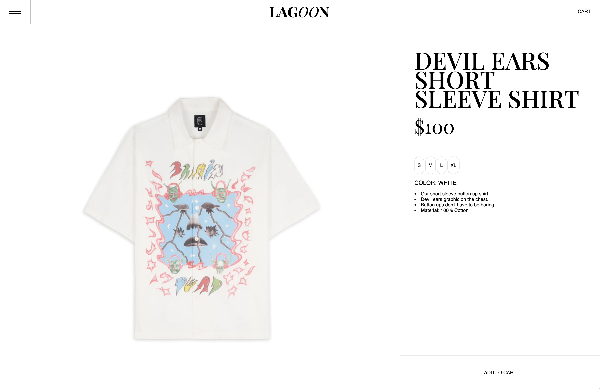
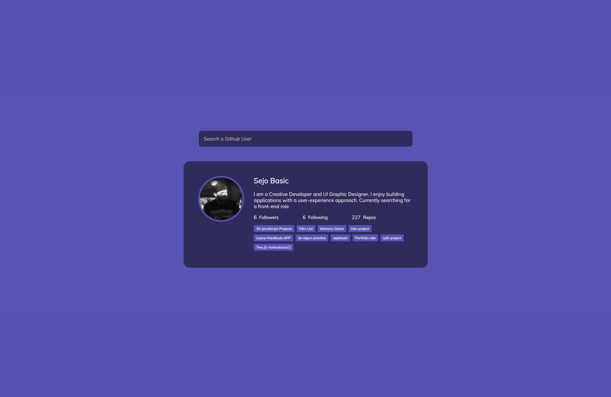
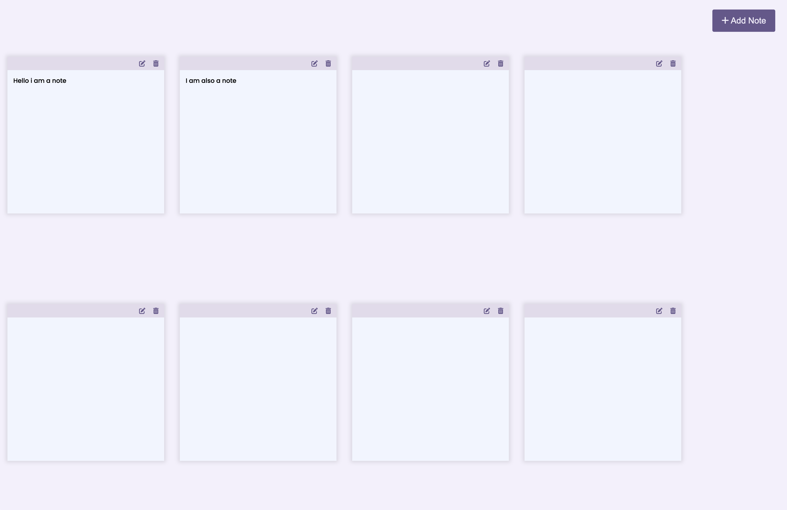
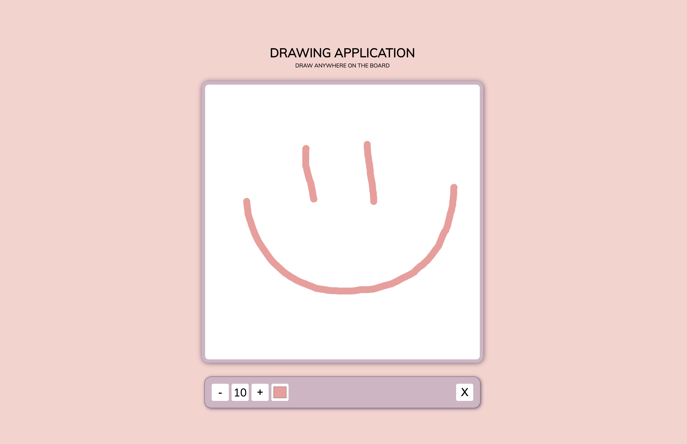

# A Collection of short Projects done in Raw HTML/CSS/JavaScript.

## Password Generator
### Generate a random 15 character password and copy to clipboard.

## Product Page
### Minimal mock product page for clothing store.

## GitHub Profile Finder
### Fetching the GitHub API displaying user data.

## Expanding Cards
### Card animation using CSS.

## Notes
### Simple notepad app that stores note state in local storage.

## Drawing Pad
### Simple drawing pad Created using canvas.

## Scoreboard
### Keep score for a game with increments.

## TABS
### Simple Chrome Extension to save tabs that get stored in local storage.

