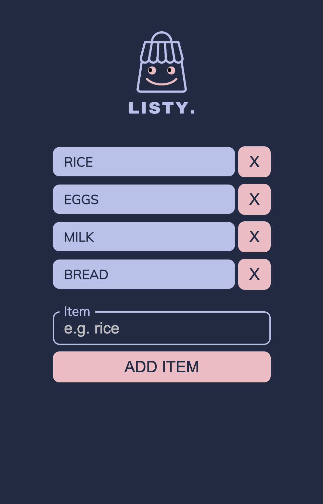
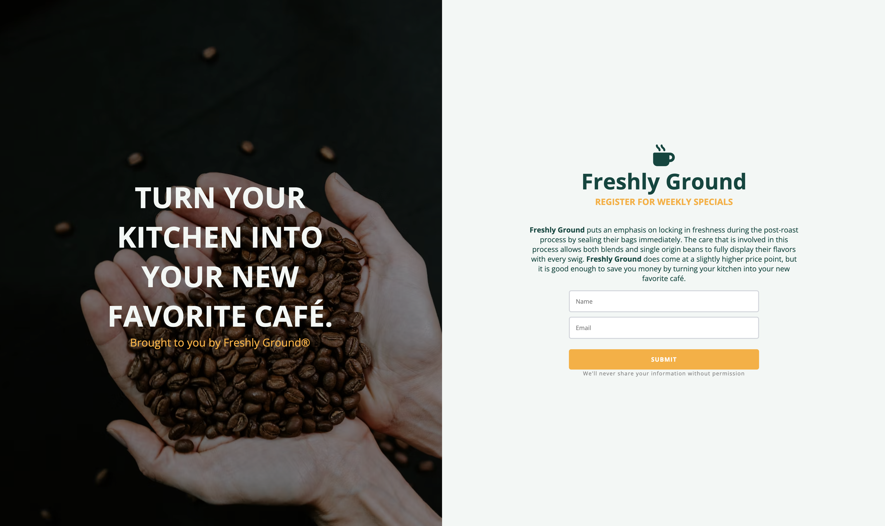
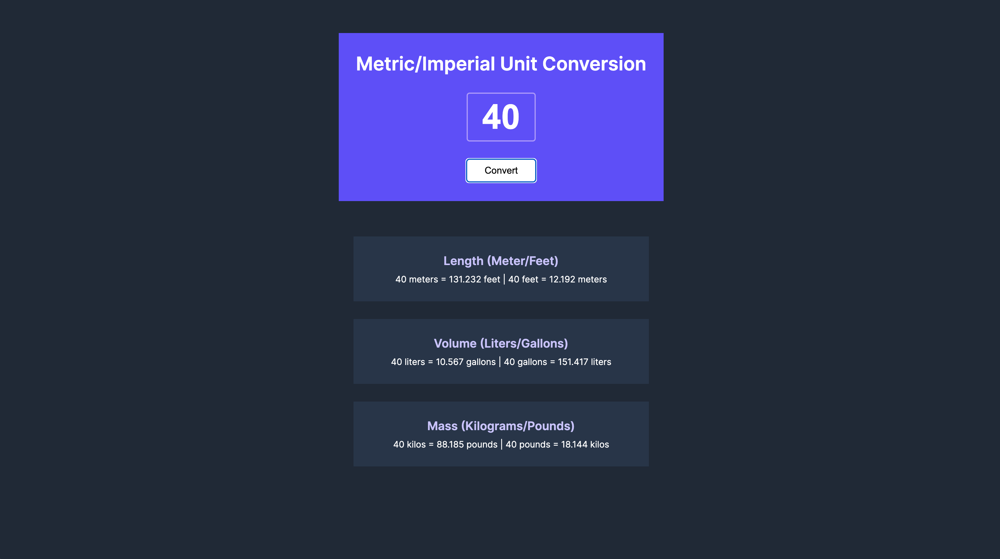
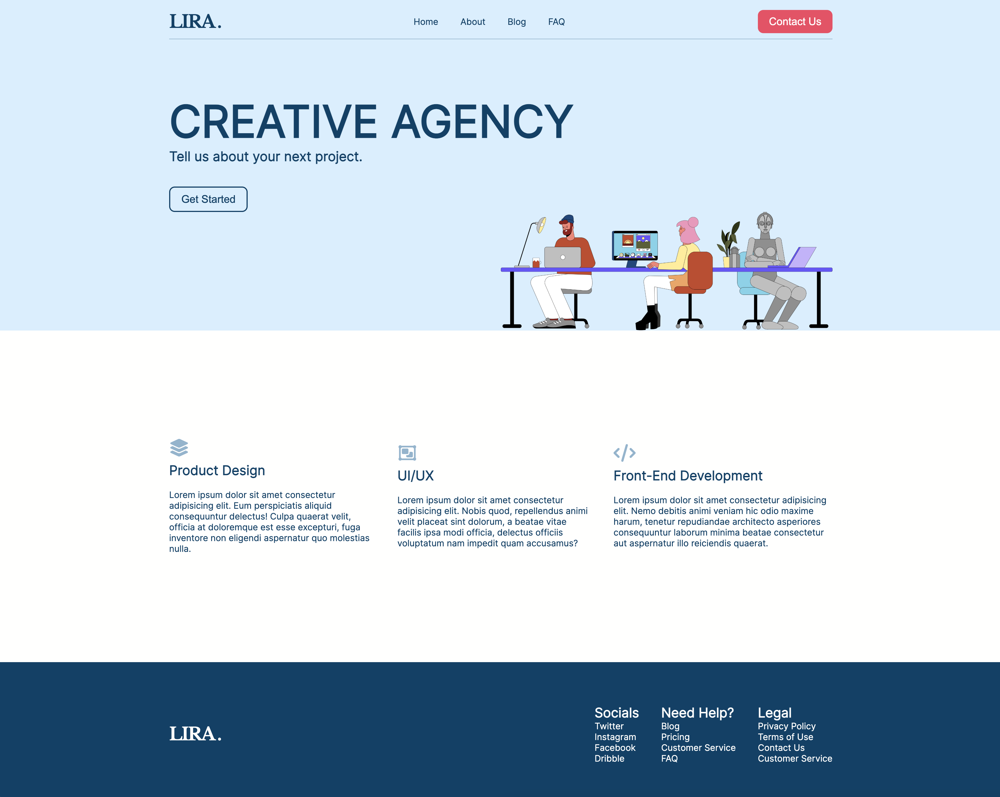

# A Collection of short Projects done in Raw HTML/CSS/JavaScript.

## Mock Mobile Ordering
[LINK TO APP](https://mobile-ordering.netlify.app)
### Mobile ordering mock app with add to cart functionality and rendering data dynamically with conditional UI.

## Twitter Clone
[LINK TO APP](https://tweeta-clone-project.netlify.app/)
### Like, Retweet and toggle comment UI interactivity  

## Password Generator
[LINK TO APP](https://js-password-gen.netlify.app)
### Generate a random 15 character password and copy to clipboard.

## Shopping List
[LINK TO APP](https://listyapp.netlify.app)
### Simple Shopping list for mobile 

## Product Page
### Minimal mock product page for clothing store.

## GitHub Profile Finder
[LINK TO APP](https://js-github-profilefinder.netlify.app)
### Fetching the GitHub API displaying user data.

## Notes
[LINK TO APP](https://jssimple-notes-app.netlify.app)
### Simple notepad app that stores note state in local storage.

## Mock Splash Page
### Splash page UI with sing-up form

## Expanding Cards
### Card animation using CSS.

## Drawing Pad
### Simple drawing pad Created using canvas.

## Scoreboard
### Keep score for a game with increments.

## TABS
### Simple Chrome Extension to save tabs that get stored in local storage.

## Unit Converter
### Application to convert metric units

## Layout Landing Page
### Mock agency layout page

## Meme Picker
### Pick F1 Memes based off your mood

